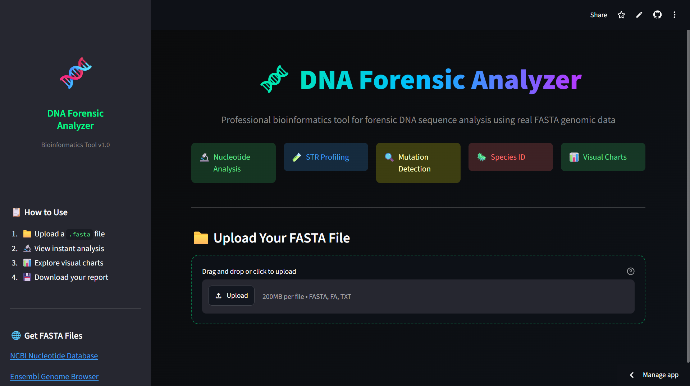

# 🧬 DNA Forensic Analyzer


A bioinformatics tool for forensic DNA sequence analysis built in Python.
Parses real FASTA-formatted genomic sequences and performs professional-grade
analysis including STR profiling, mutation detection, GC content calculation,
and species identification — all accessible through an interactive web interface.

> Tested on real genomic data including the complete SARS-CoV-2 genome
> (NC_045512.2, 29,903 bp) sourced directly from NCBI.

---

## 🖥️ Web Interface Preview



---

## 🔬 Features & Biological Significance

| Feature | Biological Significance |
|---|---|
| **Nucleotide Composition** | Foundational metric in genome characterization |
| **GC Content** | Correlates with genome stability, gene density, and organism classification |
| **Molecular Weight** | Used in gel electrophoresis to verify DNA fragment identity |
| **Species Identification** | Taxonomic classification from sequence metadata |
| **Complement & Reverse Complement** | Essential for primer design and forensic strand matching |
| **STR Analysis** | Short Tandem Repeats are the gold standard in forensic DNA profiling |
| **Mutation Detection** | Identifies SNPs and indels between sequences — critical in clinical genetics |
| **Sequence Similarity Scoring** | Pairwise alignment to determine relatedness between individuals |
| **Visual Nucleotide Chart** | Graphical representation of genome composition |
| **Exportable Report** | Full analysis saved as a structured text file |

---

## 🧪 Tech Stack

| Tool | Purpose |
|---|---|
| Python 3 | Core language |
| BioPython | Biological sequence parsing and analysis |
| Streamlit | Interactive web interface |
| Matplotlib | Data visualization |

---

## 🚀 Getting Started

### 1. Clone the repository
```
git clone https://github.com/aashukooo/dna-forensic-analyzer.git
cd dna-forensic-analyzer
```

### 2. Install dependencies
```
pip install biopython streamlit matplotlib
```

### 3. Run the web app
```
streamlit run app.py
```

### 4. Run the command line version
```
python dna_analyzer.py
```

---

## 📁 Input Format

Standard FASTA format (.fasta, .fa):
```
>Sequence_ID Species description
ATGCGTAACGTTAGCGTAGCTAGCTAGC...
```

Download real genome sequences from [NCBI Nucleotide Database](https://www.ncbi.nlm.nih.gov/nuccore)

---

## 🦠 Tested Genomes

| Organism | Accession | Length |
|---|---|---|
| SARS-CoV-2 | NC_045512.2 | 29,903 bp |
| Homo sapiens | Custom | 36 bp |
| Mus musculus | Custom | 18 bp |

---

## 📂 Project Structure

```
dna-forensic-analyzer/
│
├── app.py              # Streamlit web interface
├── dna_analyzer.py     # Command line analysis tool
├── dna_seq.c           # Original C implementation
├── sequence.fasta      # Sample test sequences
├── dna_report.txt      # Sample output report
└── README.md           
```

---

## 👩‍💻 About

Developed by an undergraduate student as an independent bioinformatics project.
Built entirely from scratch — starting with a manual C implementation to understand
low-level sequence parsing, then rebuilt in Python using BioPython for professional
grade analysis.

Genomic data sourced from the [NCBI public database](https://www.ncbi.nlm.nih.gov).

---

## 📜 License

MIT License — free to use and modify with attribution.